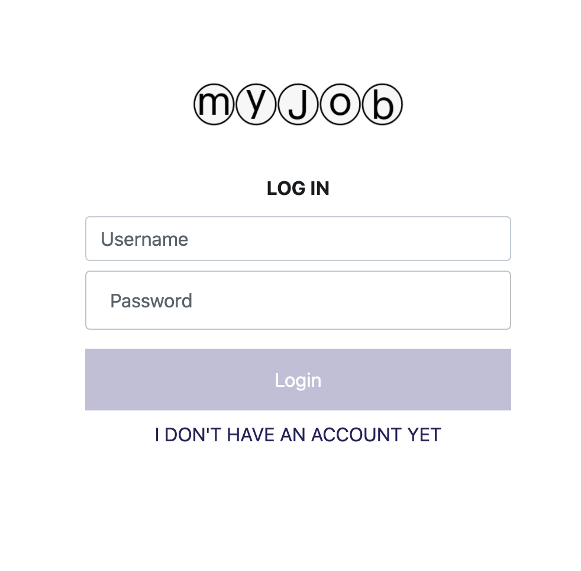
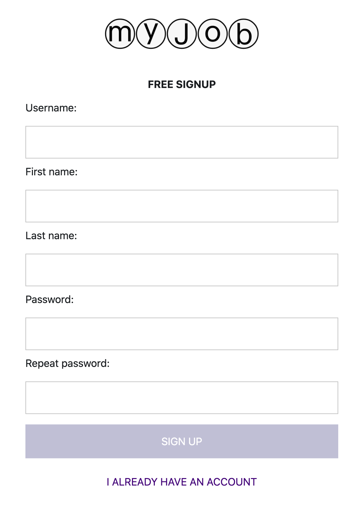
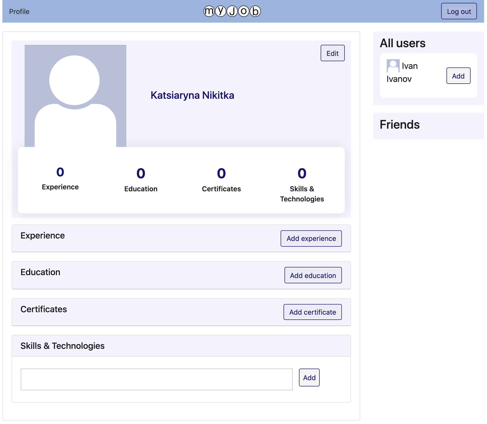
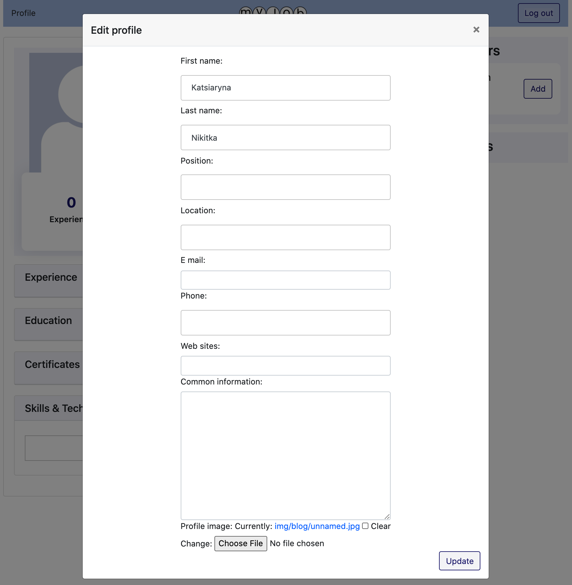
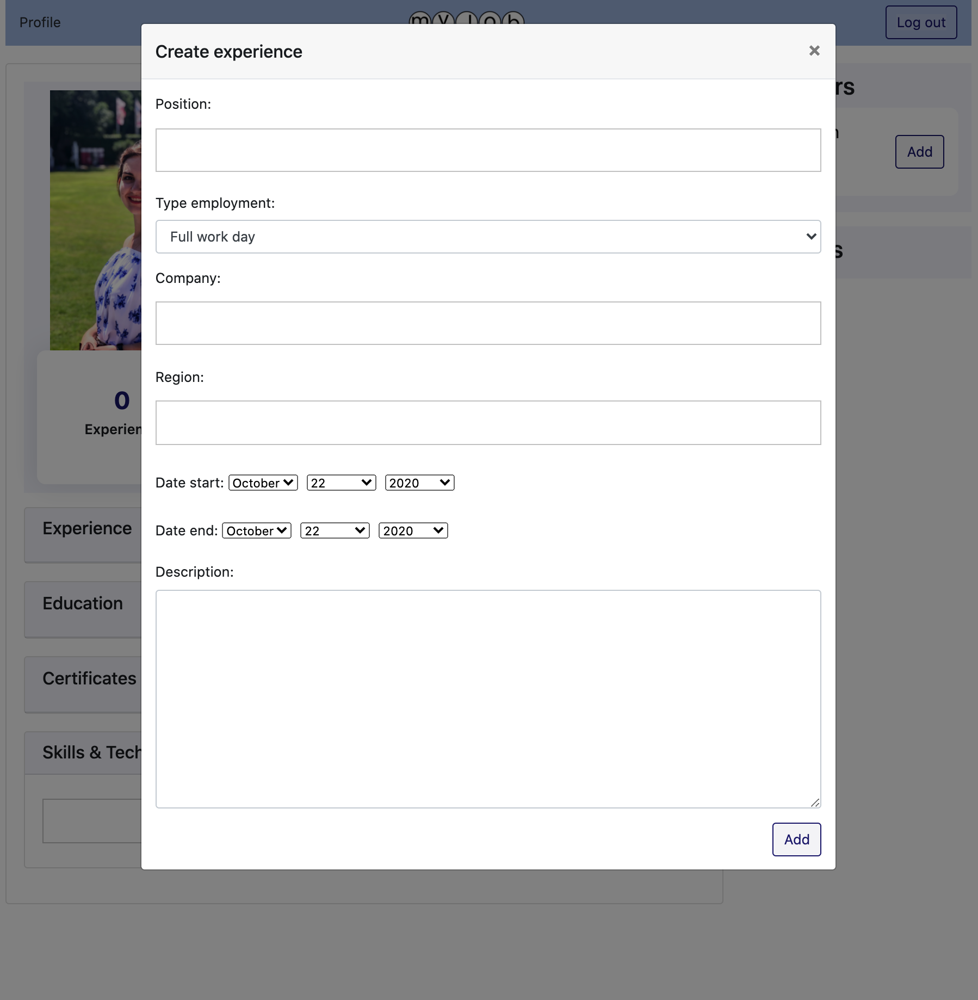
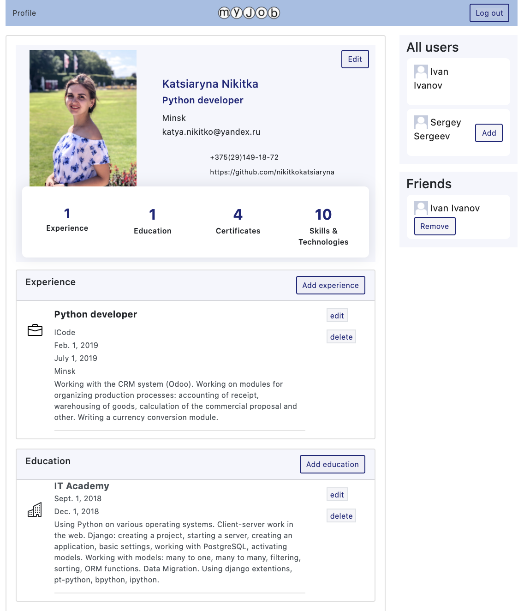
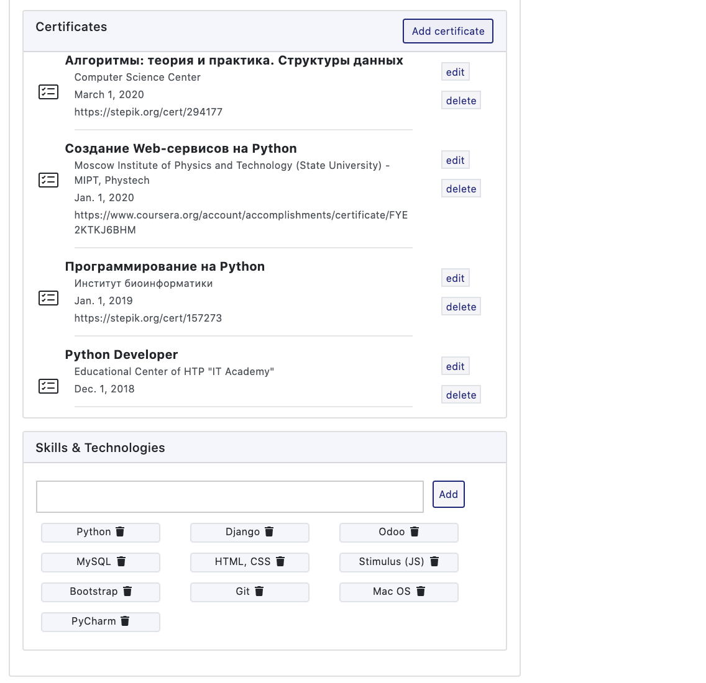
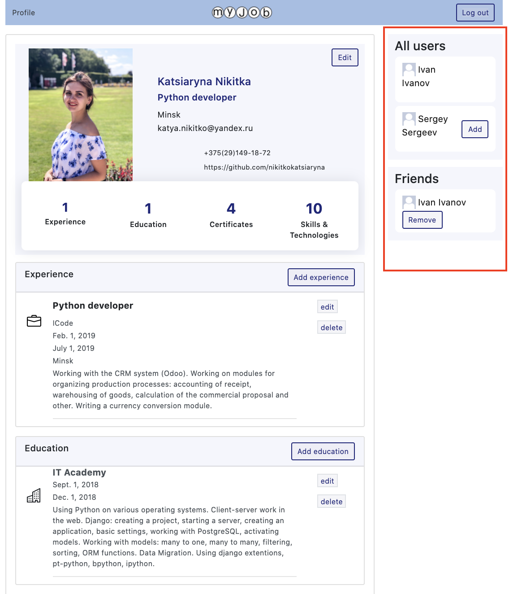

## Social network "My Job" by Kate Nikitko

Website - social network, simple version of Linkedin

Website made with Python (Django)

### Built with:
* Django framework
* Mysql
* JavaScript (Stimulus framework, Ajax)
* REST

### A quick tour of the functionality the app:

- Log in  

    

- Register

    If you don't have an account yet, you can register

    

- Account

    After registration you go to your profile page  
    When you registred you provided your name, which is displayed on your page
    
    

    The name is the first thing displayed on the page. After logging in, you can change and add other information about yourself
    
    

- Background

    You have 4 blocks when you can add information about experience, education, certificates, skills & technologies  
    
    Modal window to fill in (with ajax):
    

- Сompleted profile:
    
    Each block has "delete" and "edit" buttons

    
    

- Friends

    The page has a column with people you can make friends with
    
    Next to the person there is a button add to friends or remove from friends 
    
    